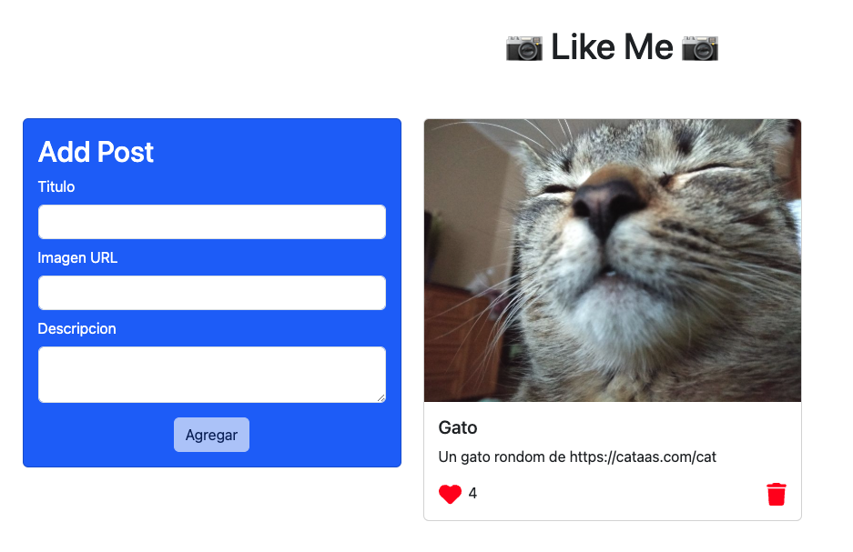

## Instrucciones:
### Clonar repositorio:
```git clone git@github.com:LuisSubiabre/node-g71-likeme-2.git```

### Database PostgreSQL 17
1.- ```CREATE DATABASE likeme;```<br>
2.- ```CREATE TABLE posts (id SERIAL, titulo VARCHAR(25), img VARCHAR(1000),
descripcion VARCHAR(255), likes INT);```<br>

## Backend
1.-```cd backend```<br>
2.-```npm install```<br>
3.-```npm run dev```<br>

## Frontend
1.-```cd frontend```<br>
2.-```npm install```<br>
3.-```npm run dev```<br>
4.-```npm install```<br>
Open: ```http://localhost:5173/```<br>



